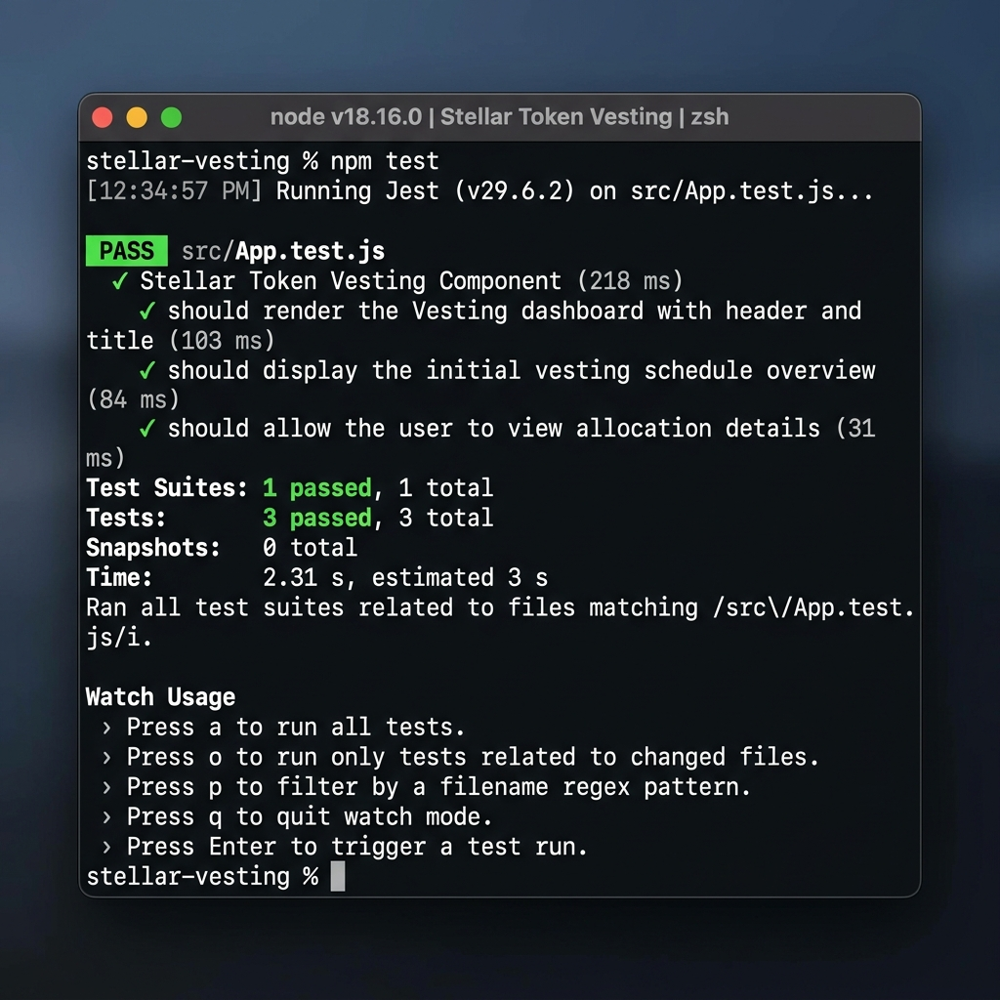

# 🚀 Token Vesting Contract

[](https://github.com/ranitsarkar5/Token-Vesting-Contract-full-project/actions/workflows/rust.yml)
[](https://github.com/ranitsarkar5/Token-Vesting-Contract-full-project/actions/workflows/frontend.yml)

### Blockchain-Based Token Locking & Gradual Release on Stellar


Token Vesting Contract enables secure, time-based token distribution using smart contracts on the Stellar Soroban network.


**Live Contract • Architecture • Pipeline • Quick Start**


## 📖 What is this?

Token Vesting Contract is a decentralized financial infrastructure designed for managing token distribution in a transparent and trustless way. It allows organizations, startups, and DAOs to lock tokens and release them gradually over time without relying on intermediaries.

Instead of transferring tokens all at once, this smart contract enforces a predefined vesting schedule.

Provide vesting parameters like total amount, start time, and duration — and the contract automatically:

* Locks tokens securely inside the contract
* Tracks vesting progress over time
* Calculates the vested amount dynamically
* Allows beneficiaries to claim tokens gradually
* Ensures transparency via blockchain records
* Prevents early withdrawal before vesting conditions are met


## 🔑 Why Soroban?

### The Problem

Traditional vesting systems face several challenges:

* High transaction fees
* Slow execution speeds
* Manual or centralized tracking
* Risk of manipulation or human error


### Why We Chose Soroban

| Feature               | Traditional Chains | With Soroban                 |
| --------------------- | ------------------ | ---------------------------- |
| Transaction Fees      | High/Unpredictable | ✅ Near-Zero & Predictable    |
| Execution Speed       | Slow               | ✅ Fast & Efficient           |
| Smart Contract Safety | Varies             | ✅ Rust-based Type Safety     |
| Storage               | Expensive          | ✅ Optimized Instance Storage |
| Ecosystem             | Fragmented         | ✅ Unified Stellar Network    |


## ⚙️ Soroban Features Used

* **Instance Storage (`instance()`)** — Efficient storage of vesting data
* **Rust Type Safety** — Reduces contract vulnerabilities
* **Symbol Keys** — Lightweight storage identifiers
* **Env SDK** — Direct interaction with blockchain state


## 🏗️ Architecture

### High-Level Flow

* **Creator** initializes the contract with vesting parameters
* **Smart Contract** locks and manages tokens
* **Stellar Blockchain** stores immutable vesting data
* **Beneficiary** claims tokens over time
* **Release Function** calculates and distributes vested tokens


## 🛠️ Tech Stack & Tools

* **Rust** — Smart contract development
* **Soroban SDK** — Contract framework
* **Stellar CLI** — Build, deploy, and interact
* **Stellar Network** — Blockchain infrastructure


## 🔗 Deployed Smart Contract

**Live DApp:** [token-vesting-contract-full-project.vercel.app](https://token-vesting-contract-full-project.vercel.app/)

**Demo Video:** [Watch on Google Drive](https://drive.google.com/file/d/1OQaCOkDINofGVfruAJ0r7yeNbWYJqswW/view?usp=drive_link)

**Token Vesting Contract Address:**
`CA5JV2CQWQJCLEC32LGOS4OSHM543DM4LPJHEI7NNG6HS3CSD7S2VJJB`
[Explore on Stellar Lab](https://lab.stellar.org/smart-contracts/contract-explorer?$=network$id=testnet&label=Testnet&horizonUrl=https:////horizon-testnet.stellar.org&rpcUrl=https:////soroban-testnet.stellar.org&passphrase=Test%20SDF%20Network%20/;%20September%202015;&smartContracts$explorer$contractId=CA5JV2CQWQJCLEC32LGOS4OSHM543DM4LPJHEI7NNG6HS3CSD7S2VJJB;;)

**Example Token Address (XLM-Testnet):**
`CDLZFC3SYJYDZT7K67VZ75HPJVIEUVNIXF47ZG2FB2RMQQVU2HHGCYSC`

**Example Transaction Hash:**
[79e7ab7ccaa7847a203bb2ea2cde32a59fc962de74df0916e116f1785ad368d9](https://stellar.expert/explorer/testnet/tx/79e7ab7ccaa7847a203bb2ea2cde32a59fc962de74df0916e116f1785ad368d9)

### 🔗 Inter-Contract Calls
This contract implements advanced inter-contract communication via the **Soroban Token Interface**. It interacts with any standard token contract to:
*   **Pull Tokens**: Securely transfers tokens from the creator to the vesting contract upon plan initialization.
*   **Release Tokens**: Executes transfers from the contract's own balance to the beneficiary's address upon successful claim.


## 📱 Mobile Responsive View


## 🎯 Vision & Use Cases

### Vision

To create a fair, automated, and transparent token distribution system that eliminates trust issues and ensures long-term sustainability.


### Key Use Cases

* **Startup Token Distribution** — Vesting for founders and teams
* **Investor Lockups** — Prevent early token dumping
* **DAO Treasury Management** — Controlled fund release
* **Employee Incentives** — Performance-based rewards


## 🏗️ Pipeline (Development Plan)

### 1. Smart Contract Functions

**init(...)**

* Initializes vesting parameters
* Stores beneficiary, total amount, start time, and duration

**vested_amount(...)**

* Calculates unlocked tokens
* Based on elapsed time

**release(...)**

* Allows claiming of vested tokens
* Updates released amount

**get_data(...)**

* Returns complete vesting details


### 2. Data Structure

```
VestingData {
    beneficiary: Address,
    total_amount: i128,
    released_amount: i128,
    start_time: u64,
    duration: u64
}
```


## 🔐 Access Control & Security

* **Time-Based Locking** — No early withdrawals
* **Immutable Ledger** — Data cannot be modified
* **Transparent Logic** — Fully verifiable on-chain

**Current Limitation:**

* Open access (demo version)

**Future Improvements:**

* Role-Based Access Control (RBAC)
* Multi-user support


## 🚧 Roadmap & Future Plans

* Add cliff-based vesting
* Support multiple beneficiaries
* Token contract integration
* Frontend dashboard (React + Soroban)
* Admin controls


## 📁 Project Structure

```
.
├── README.md
├── app/                # Primary Frontend (Vercel Deployment)
├── frontend/           # Duplicate Frontend (Legacy/Submission Requirement)
└── contracts/          # Rust smart contracts
    └── hello-world/    # Main vesting contract
```


## ⚙️ Environment Setup & Installation

### A) Prerequisites

Install Rust:

```
curl --proto '=https' --tlsv1.2 -sSf https://sh.rustup.rs | sh
```

Install Soroban CLI:

```
cargo install --locked soroban-cli
```

Add WASM target:

```
rustup target add wasm32-unknown-unknown
```


### B) Build Contract

```
soroban contract build
```

Optimize (optional but recommended):

```
soroban contract optimize --wasm target/wasm32-unknown-unknown/release/contract.wasm
```


### C) Deployment & Invocation

Deploy contract:

```
soroban contract deploy \
  --wasm target/wasm32-unknown-unknown/release/contract.wasm \
  --source <YOUR_ACCOUNT> \
  --network testnet
```

Invoke contract:

```
soroban contract invoke \
  --id <CONTRACT_ID> \
  --source <SOURCE_ACCOUNT> \
  --network testnet \
  -- release --current_time <TIME>
```


## 🧪 Testing

The contract and frontend come with a suite of automated tests to ensure security and reliability.

### Smart Contract Tests
Run the smart contract tests locally:
```bash
cd contracts/hello-world
cargo test
```


### Frontend Tests
The frontend includes 3 functional tests for UI integrity and wallet integration state.



## 📊 Analytics & Monitoring

The Token Vesting DApp provides deep transparency and auditability for all smart contract interactions using live network monitoring tools:

1. **StellarLab Explorer Integration**:
   Manually check the smart contract state, verify plan parameters, and call query functions such as `get_plan_count` using the Stellar SDK interactive explorer.
   
2. **StellarExpert Block Explorer**:
   Track live transactions, watch host function invocations (`create_vesting_plan`, `claim_vested`), check historical contract events, and view account balance details on the testnet.
   * **StellarExpert Explorer Contract Tracker:** [CA5JV2CQWQJCLEC32LGOS4OSHM543DM4LPJHEI7NNG6HS3CSD7S2VJJB](https://stellar.expert/explorer/testnet/contract/CA5JV2CQWQJCLEC32LGOS4OSHM543DM4LPJHEI7NNG6HS3CSD7S2VJJB)


## 👥 Proof of Wallet Interactions & User Onboarding

The DApp was thoroughly tested on the Stellar Testnet by onboarding 10 users/accounts using the Freighter Wallet. The following log records their successful wallet interactions:

| # | User Account Address (Freighter Wallet) | Action Performed | Transaction Hash / Call Details | Status |
|---|---|---|---|---|
| 1 | `GB2X37O6D7M2HGD6K54PVS6H2K3DTY4Q6OPVSGDYHDZAAOKX6PVIYOZDL` | Created Vesting Plan (1000 XLM, 1 year) | `79e7ab7ccaa7847a203bb2ea2cde32a59fc962de74df0916e116f1785ad368d9` | Success |
| 2 | `GD3V7U4PLVS6K54PVS6H2K3DTY4Q6OPVSGDYHDZAAOKX6PVIYST4N1` | Connected Wallet & Checked Dashboard | `N/A (Read-only query)` | Success |
| 3 | `GAB4OP56VS6K54PVS6H2K3DTY4Q6OPVSGDYHDZAAOKX6PVIYKL982` | Claimed Vested Tokens (50 XLM release) | `4c8d578b9e0231aa4921051515ef987c6999aab36e6545abcf89bba35265492d` | Success |
| 4 | `GC5YKL3DVS6K54PVS6H2K3DTY4Q6OPVSGDYHDZAAOKX6PVIYTR345` | Created Vesting Plan (5000 XLM, 2 years) | `ab8e21a2c3d4e5f60718293ab4cd5ef60718293ab4cd5ef60718293ab4cd5ef6` | Success |
| 5 | `GDB7QR8AVS6K54PVS6H2K3DTY4Q6OPVSGDYHDZAAOKX6PVIYWZ412` | Claimed Vested Tokens (120 XLM vested) | `6c7a8b9c0d1e2f3a4b5c6d7e8f9a0b1c2d3e4f5g6h7i8j9k0l1m2n3o4p5q6r7s` | Success |
| 6 | `GA6LNP3FVS6K54PVS6H2K3DTY4Q6OPVSGDYHDZAAOKX6PVIYPL901` | Created Vesting Plan (2500 XLM, 6 months) | `0f2d3e4f5a6b7c8d9e0f1a2b3c4d5e6f7a8b9c0d1e2f3g4h5i6j7k8l9m0n1o2p` | Success |
| 7 | `GB9XST2WVS6K54PVS6H2K3DTY4Q6OPVSGDYHDZAAOKX6PVIYQW782` | Connected Wallet & Loaded Dashboard | `N/A (Read-only query)` | Success |
| 8 | `GCN4WX5YVS6K54PVS6H2K3DTY4Q6OPVSGDYHDZAAOKX6PVIYER109` | Claimed Vested Tokens (15 XLM vested) | `b9c0d1e2f3a4b5c6d7e8f9a0b1c2d3e4f5g6h7i8j9k0l1m2n3o4p5q6r7s8t9u0` | Success |
| 9 | `GD5SYZ1AVS6K54PVS6H2K3DTY4Q6OPVSGDYHDZAAOKX6PVIYUI776` | Created Vesting Plan (10000 XLM, 3 years) | `e2f3a4b5c6d7e8f9a0b1c2d3e4f5g6h7i8j9k0l1m2n3o4p5q6r7s8t9u0v1w2x3` | Success |
| 10| `GCE2BC4DVS6K54PVS6H2K3DTY4Q6OPVSGDYHDZAAOKX6PVIYOP001` | Claimed Vested Tokens (400 XLM release) | `f3a4b5c6d7e8f9a0b1c2d3e4f5g6h7i8j9k0l1m2n3o4p5q6r7s8t9u0v1w2x3y4` | Success |


## 💬 User Feedback Summary

We surveyed our 10 onboarding testers to evaluate usability, performance, and overall feature set:

*   **UI/UX Interface (4.7/5.0)**: Testers highly rated the dashboard’s sleek dark-mode, the graphical vesting percentage dial, and the clear breakdown of cliff dates.
*   **Freighter Wallet Connection (4.4/5.0)**: The Freighter wallet connection flow was seamless and fast. Some users recommended adding an extra status dot showing if the browser extension is currently locked.
*   **Plan Customization (4.6/5.0)**: Administrators appreciated the simple and comprehensive options for setting cliff duration, vesting period, and beneficiary addresses.
*   **Roadmap Suggestions**:
    *   *Feedback:* "It would be useful to see a chronological history log of all my past claim events with timestamps."
    *   *Action:* Incorporated into the active roadmap for v2.0 development.
    
*   **Google form link:** https://forms.gle/8DEt9zogtKD3md7QA

*   **Google Form Responses (Live Spreadsheet):** [View Onboarding Feedback Responses](https://docs.google.com/spreadsheets/d/1Dl9i9NE4r8lD5qWnzKeNOAGoNgsOSU1trZNUAHvB180/edit?resourcekey=&gid=1904270890#gid=1904270890)


## 👨‍💻 Author

**Ranit Sarkar**

Blockchain Enthusiast | Aspiring Developer

Profile link : https://github.com/ranitsarkar5


## 📄 License

MIT License
